= Mastercoin Developer's Guide
Mastercoin Team
v0.1, May 21, 2014: Early draft
:numbered:
:toc:
:toclevels: 3
:linkattrs:

The Mastercoin Developer's Guide aims to be a comprehensive reference guide for Mastercoin developers. It provides a brief overview of Mastercoin, pointers to external Mastercoin documentation and resources, introductory information on the Mastercoin specification, and information on Mastercoin implementations and select applications.

== Introduction to Mastercoin

=== Mission

The Master Protocol facilitates the creation and trading of smart properties and user currencies as well as other types of smart contracts. Mastercoins serve as the binding between bitcoins (BTC), smart properties and smart contracts created on top of the Master Protocol.

Mastercoin enables Bitcoin ecosystem service providers to function in decentralized and p2p mode. Adoption of the Master Protocol will drive higher value economic transactions on the Bitcoin blockchain, which is good for Bitcoin miners and savers.

For more information see the http://www.mastercoin.org[Mastercoin website]

=== Features

* Decentralized Exchange
+
The capability to trade bitcoins for other digital currencies without having to use a third party. Master Protocol makes this possible by leveraging the Bitcoin blockchain as the "third party" and using Bitcoin's distributed timestamping service.

* Smart Poperty
+
Smart properties are digital property and contracts rights, which may be transferred. Smart tokens can represent services, products, titles, deeds, virtual currencies, and securities.
+
Mastercoin Foundation plans and funds the development of the Master Protocol for the creation of smart tokens, and is involved in fostering adoption by services meeting the needs of people, governments and businesses.

* User Currencies
+
Master Protocol enabled applications will allow anyone to design and release their own smart tokens, with their own rules, without doing any software development. 
+
Crowd Sale type virtual currencies and smart tokens will be available as of April 22, 2014.

* Savings Wallets
+
A savings wallet is a collection of saving addresses. The Saving Address feature is designed to increase hot wallet security while preserving ease of use.
+
The transactions sent from those addresses are reversible for the specified time period.

=== History

January 6, 2012::
http://www.mastercoinfoundation.org/#team[J. R. Willett] https://bitcointalk.org/index.php?topic=56901.0[publishes] Version 0.1 of https://sites.google.com/site/2ndbtcwpaper/2ndBitcoinWhitepaper.pdf[The Second Bitcoin Whitepaper].

August 1, 2013::
https://blockchain.info/address/1EXoDusjGwvnjZUyKkxZ4UHEf77z6A5S4P[Exodus Address] begins receiving Bitcoins.

August 31, 2013::
"Exodus Address" stops receiving Bitcoins. 63,162.4 MSC are generated and sent to those who sent Bitcoins to the Exodus address. 56,316.2 development MSC are also genereated for a total of 619,478.6 MSC created. Additional MSC will not be created.

??::
Major specification upgrade.

??::
Major software release.

4/22/14::
Maidsafe sale.

NOTE::
I want to have only 6-9 major milestones here to keep this short.

For more information see:

* http://wiki.mastercoin.org/index.php/Timeline
* http://masterprotocoleducation.org/history-of-the-master-protocol/
* http://blog.mastercoin.org/2013/11/29/a-brief-history-of-mastercoin/

NOTE::
Which of the above 3 links should we keep?

== Overview of Ecosystem

This section provides an overview of the Mastercoin ecosystem with links to the relevant resources.

=== Implementations

There are multiple implementations of the Master Protocol available. <<imp-mastercoin-tools>> is the current reference implementation (which is used by OmniWallet). We have begun work on a new reference implementation <<imp-mastercore>>, but it has not been released yet.

[#imp-mastercoin-tools]
==== Mastercoin Tools

https://github.com/grazcoin/mastercoin-tools[Mastercoin Tools] is a set of Python libraries and command-line tools that in turn depends upon the SX command from libbitcoin.

For more information see the https://github.com/grazcoin/mastercoin-tools[README on Github].

[#imp-mastercore]
==== Mastercore

Mastercore is in the early stages of development and is not ready for real-world use yet, but it is likely to become the new reference implementation for Mastercoin.

Mastercore is based upon https://github.com/bitcoin/bitcoin[Bitcoin Core] -- the reference implementation of Bitcoin. Mastercore adds support for the Master Protocol, while leaving the existing Bitcoin functionality unchanged.

==== Other

TBD

=== Notable Wallet Applications

There are a handful of Mastercoin-enabled wallets for web and desktop platforms. We'll highlight a few of them here.

==== Omniwallet

Omniwallet is a major focus of development for the Mastercoin Foundation. You can find the https://github.com/mastercoin-MSC/omniwallet [source code and a helpful README] file on Github.

==== Masterchest

The Masterchest wallet is a desktop wallet for the Windows platform. See the https://github.com/zathras-crypto/masterchest-wallet[source and README] on Github,

==== Other

TBD

=== Notable Master currencies
==== Mastercoin
==== Test Mastercoin
==== MaidSafeCoin
==== Other

=== Mastercoin Documentation & Resources

* http://www.mastercoin.org[Mastercoin] 
* http://www.mastercoinfoundation.org[Mastercoin Foundation]
* http://wiki.mastercoin.org/index.php/Main_Page[Mastercoin Dev Wiki]
* http://masterprotocoleducation.org[Master Protocol Education]

== Introduction to the Master Protocol

This section is TBD. For now your best starting point is the https://github.com/mastercoin-MSC/spec[Specification] itself.

=== Overview of key Mastercoin concepts and terminology
=== Review of key Bitcoin features used by Mastercoin
=== Introduction to the Specification and overview of it's contents

== Getting Started

The best way to get started is to build (install) and run one of our implementations.

=== Building and running a full Mastercoin implementation

We have produced http://www.vagrantup.com[Vagrant] configurations for automatically creating https://www.virtualbox.org[VirtualBox] Virtual Machines running recent versions of Mastercoin components and stable versions of prerequisite components.

==== Mastercoin-tools

Follow the instructions in https://github.com/mastercoin-MSC/install-msc/blob/vagrant/README-Vagrant.md#installing-mastercoin-tools[Installing Mastercoin Tools] on the +install-msc+ repo. (In the +vagrant+ branch for now.)
 
==== Mastercore (aka mastercoind)

Follow the instructions in https://github.com/mastercoin-MSC/install-msc/blob/vagrant/README-Vagrant.md#installing-mastercore[Installing Mastercore] on the +install-msc+ repo. (In the +vagrant+ branch for now.)

==== Omniwallet

TBD.

== Proposed Mastercoin RPC API

The Mastercore implementation of Mastercoin will include a http://www.jsonrpc.org[JSON-RPC] API that allows access to key Mastercoin features over the HTTP(S) protocol. As Mastercore is based upon Bitcoin Core, the Mastercoin JSON-RPC API will be a superset of the API provided by Bitcoin.

The Bitcoin RPC API is documented in the https://en.bitcoin.it/wiki/Original_Bitcoin_client/API_Calls_list[Bitcoin API Calls List]. This section documents the additional commands planned for addition by Mastercoin.

WARNING::
This is preliminary information. The API is currently subject to change. We are currently in active development and are soliciting internal and external feedback on the functionality and naming conventions for the API.

[options="header",frame="all"]
|===
| Command | Parameters | Description | Requires Unlocked Wallet | Notes

| +getMPbalance+
| +address+ +currencyID+
| Retrieve balance of MP currency/address pair
| N
| Implemented

| +listMPtransactions+
| +address+ +currencyID+
| List history of MP currency/address pair
| N
| To Do

| +sendMPsimple+
| +fromaddress+ +toaddress+ +currencyID+ +amount+
| Simple send
| Y
| To Do

| +getMPtransaction+
| +txid+
| Return JSON array of MP transaction
| N
| To Do

| +getMPconsensus+
|
| +{"error:null,result:"IAMTHELAW"}+
| N
| ;)

|===

=== Types

address::
A https://en.bitcoin.it/wiki/Address[Bitcoin address].

currencyID::
A Master Protocol https://github.com/mastercoin-MSC/spec#field-currency-identifier[currency identifier].

amount::
The number of coins or tokens in a Master Protocol transaction.  See https://github.com/mastercoin-MSC/spec#field-number-of-coins[Number of coins] in the spec.

=== Methods

This section provides more detailed explanation of each RPC method. More details will be added over time.

==== getMPbalance

Returns the balance of +currencyID+ in +address+

==== listMPtransactions

Returns a list of all Master Protocol transactions for a given +address+ and +currencyID+

(Unspecified +currencyID+ gives all transactions for all currency IDs?)

==== sendMPsimple

Send a Master Protocol currency from +fromaddress+ to +toaddress+.

Issues:

* Divisibility?

==== getMPtransaction

Return JSON array of an MP transaction specified by +txid+.

==== getMPconsensus

Yes, we really expect Mastercore to become the reference implementation of Master Procool. :)

== Contributing to Mastercoin

This section contains procedures and guidelines for contributing to Mastercoin. More sections will be added as they are created.

=== Using GPG keys for Git Commits

Siging your commits with PGP/GPG is recommended to help ensure your code is trusted when commiting upstream to the Mastercoin repository. To setup
your key, you will need a copy of GPG for your OS: https://www.gnupg.org/

Installation, key creation, and publishing::
See the instructions for your Operating System below.

=== Linux
To setup your key, you will need a copy of GPG for your OS: https://www.gnupg.org/ 

Listing keys::
`gpg -k` or `gpg --list-keys` will list all keys on your system.
Installation::
After downloading and installing, run: `gpg --gen-key` and follow the prompts to generate your key.
Uploading your key to a keyserver::
 `gpg --send-keys (key identifier)` note: the identifier is a 4-byte hex value ex. "0xDEADBEEF"
Contact a developer:: 
Contact another Mastercoin developer and have him or her verify the integrity of your key, so that we can include you in the Mastercoin web of trust.
Committing code::
Add your key to your git config with `git config --global user.signingkey key_identifier` 
Sign future commits with `git -S -m "(message)"`

If you're using a Git GUI, see the instructions for your particular software for GPG signing.

==== Mac

Recommeded Tools::

* https://gpgtools.org[GPG Suite], which includes:
** MacGPG (command line tools)
** GPG Keychain
** GPG Services
** GPG for Mail (plugin for Apple Mail)
* https://www.enigmail.net[Enigmail] (optional, if you're using Mozilla Thunderbird)

Installation and Setup::

* Download and run the GPG Suite Installer
* Create a key pair and publish your public key
** Open *GPG Keychain Access*
** Click the *New* key icon to create a new key pair.
** Enter your name and email address
** Check *Upload public key after generation*

Importing keys::

* Get the new developer's Key ID via a trusted communications channel
* Use the *Key* / *Retrieve from Keyserver…" menu in *GPG Keychain Access*
* Enter the Key ID and click *Retrieve Key*

Signing keys::

* Select the key you want to sign in the *GPG Keychain Access* window
* Choose the *Key* / *Sign…" menu
* Indicate how carefully you have verified the key from the pop-up menu.
* Click *Generate Signature*
* Choose the *Send public key to Keyserver"

=== Windows

To setup your key, you will need a copy of GPG for your OS: https://www.gpg4win.org 

Downloading::

Visit https://www.gpg4win.org/download.html and grab a copy of GPG4Win (22meg).

Installing::

* Make sure GPA is selected (Kleopatra not necessary) at a minimum, and proceed. 

*** 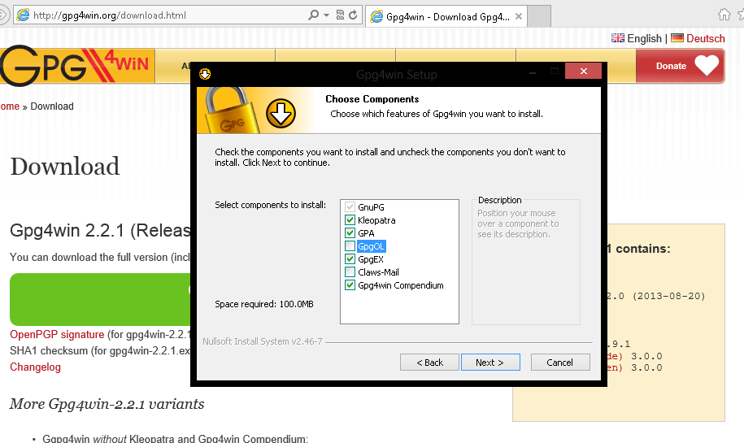

* More installation default suggestions.

*** 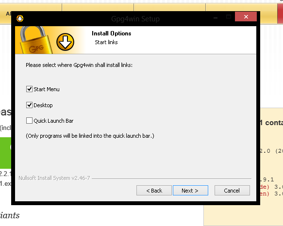

* Hit finish to complete
*** image:images/Selection_144.png[]

Using GPA::

* This is the GPA icon
*** 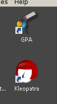

* Hit generate key now
*** 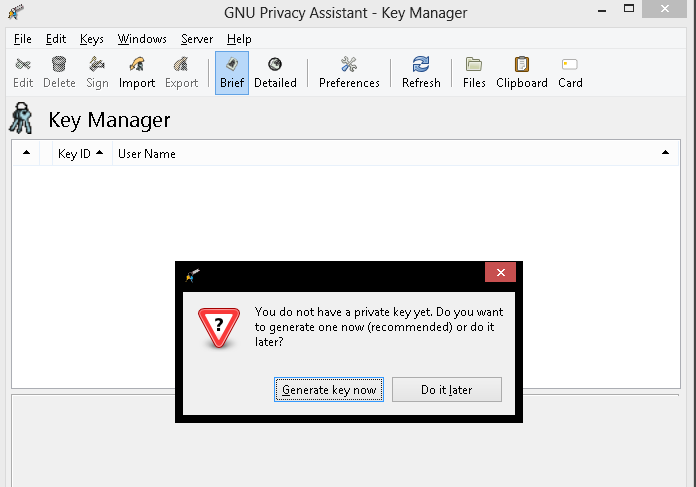

* Insert your personal details
*** 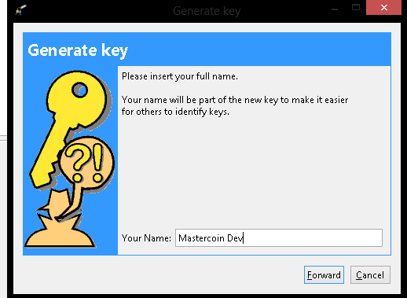

* More details
*** 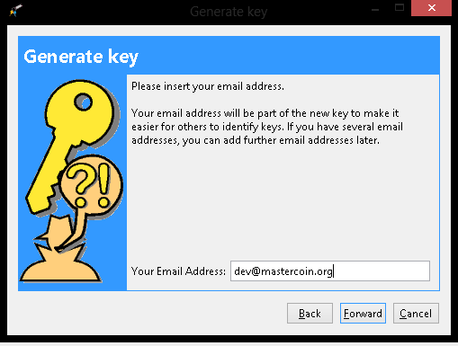

* Important: Enter a secure passphrase, this will be used to sign commits, messages and so on
*** 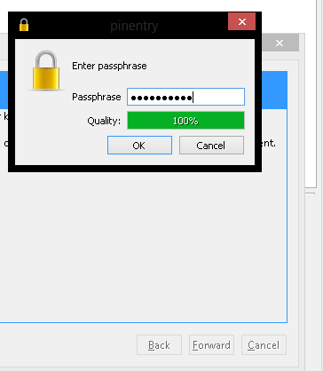

* You will see your newly generated key after following the prompts
*** 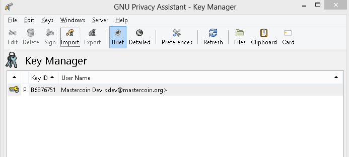

Uploading to keyserver::

* Right click your name
*** 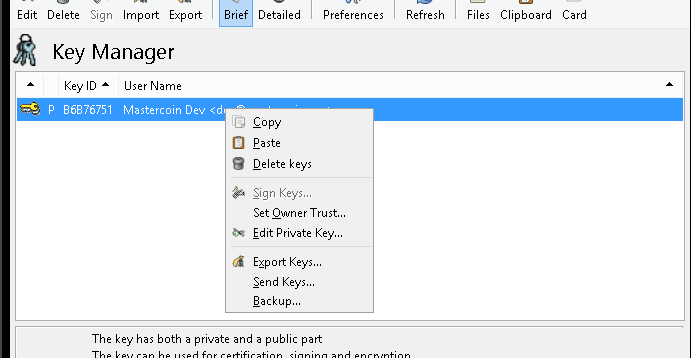

* Click Send Keys
*** 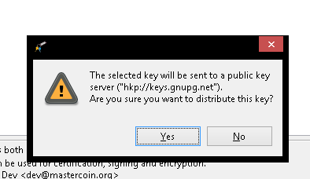

* Hit OK to distribute your key

Signing other keys::

* After verifying another person's identity, add a key:

*** 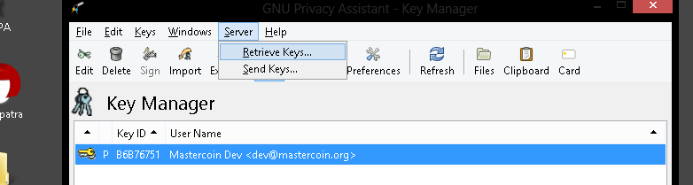

* Enter their KEY ID:
*** 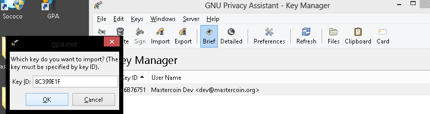

* Right click and hover over Sign keys:
*** 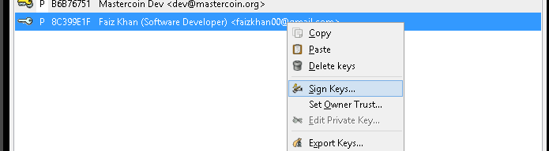

* Agree to sign (if identity is verified)
*** 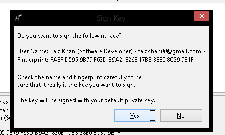

* Enter your passphrase
*** 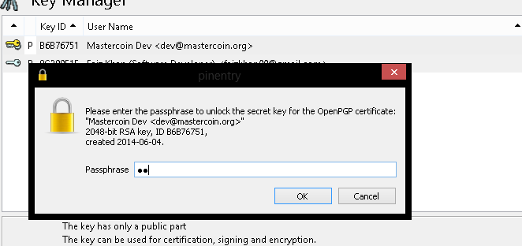

* Right click the person's key and hit send keys
*** 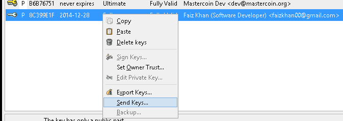

* Hit ok to distribute
*** 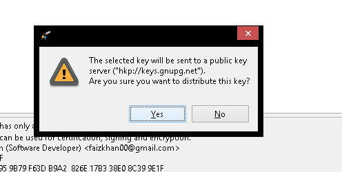

*All done!*

== How to improve this document

This document was created with http://asciidoctor.org[AsciiDoctor] a powerful markdown format especially suited for software project documentation. The markdown source is stored in the https://github.com/mastercoin-MSC/mastercoin-MSC.github.io/tree/source/[+source+ branch] of the [mastercoin-MSC.github.io] repository on Github in the file https://github.com/mastercoin-MSC/mastercoin-MSC.github.io/blob/source/adoc/dev-guide.adoc[dev-guide.adoc].

The easiest way to make a change is to edit the file directly on Github. Github supports AsciiDoctor directly so just edit the file https://github.com/mastercoin-MSC/mastercoin-MSC.github.io/blob/source/adoc/dev-guide.adoc[dev-guide.adoc].

If you want to check the file out with Git and work locally, there are browser plugins for Live Preview of Asciidoctor:

* https://chrome.google.com/webstore/detail/asciidoctorjs-live-previe/iaalpfgpbocpdfblpnhhgllgbdbchmia[Asciidocgtor.js Live Preview] for Google Chrome
* https://github.com/asciidoctor/asciidoctor-firefox-addon[Asciidoctor Firefox Addon] for Mozilla Firefox.

NOTE::
The Google Chrome plugin works well, I haven't tried the Firefox one yet.

There are many other tools and toolchains that support Asciidoctor, but the above are the easiest to get started with.

